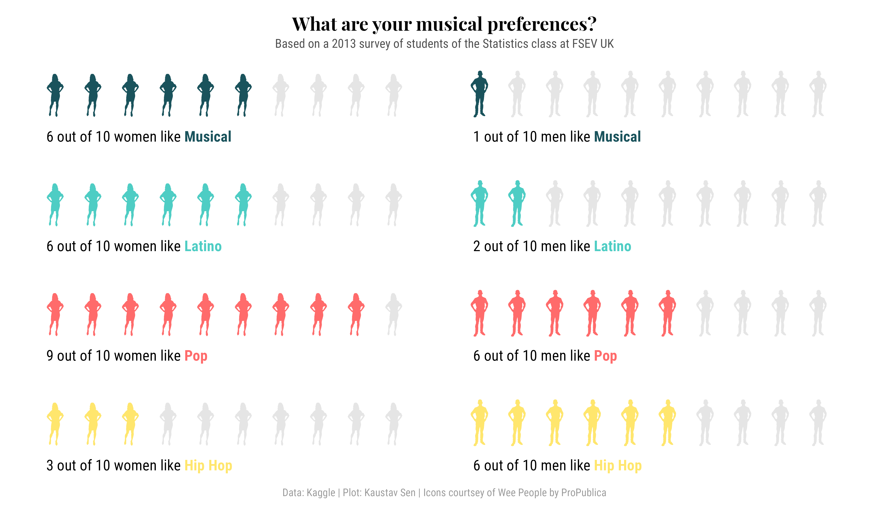
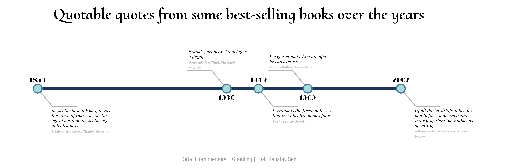
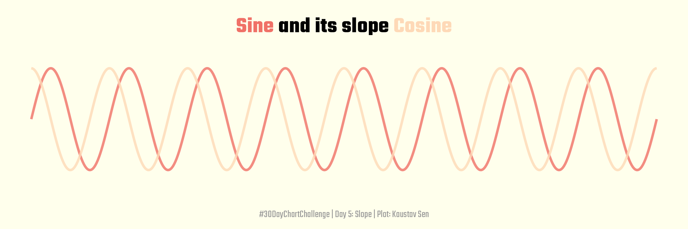
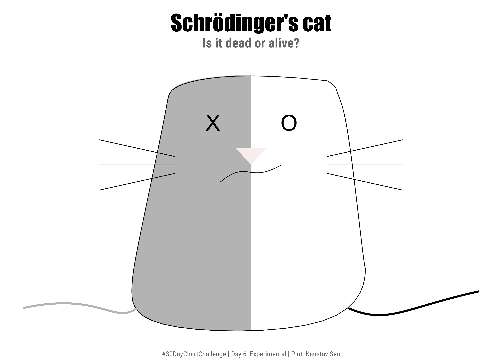
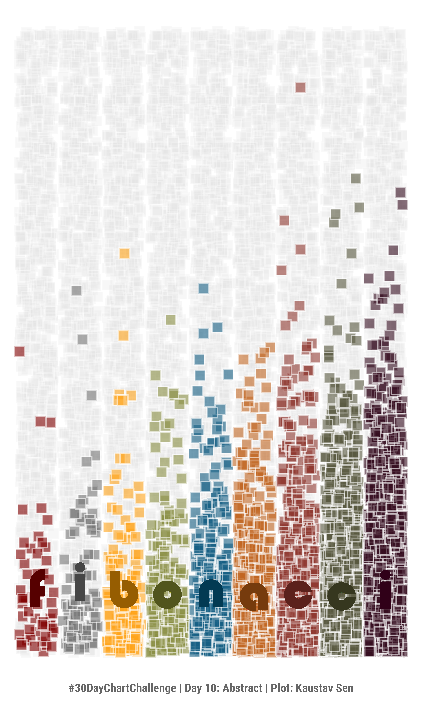
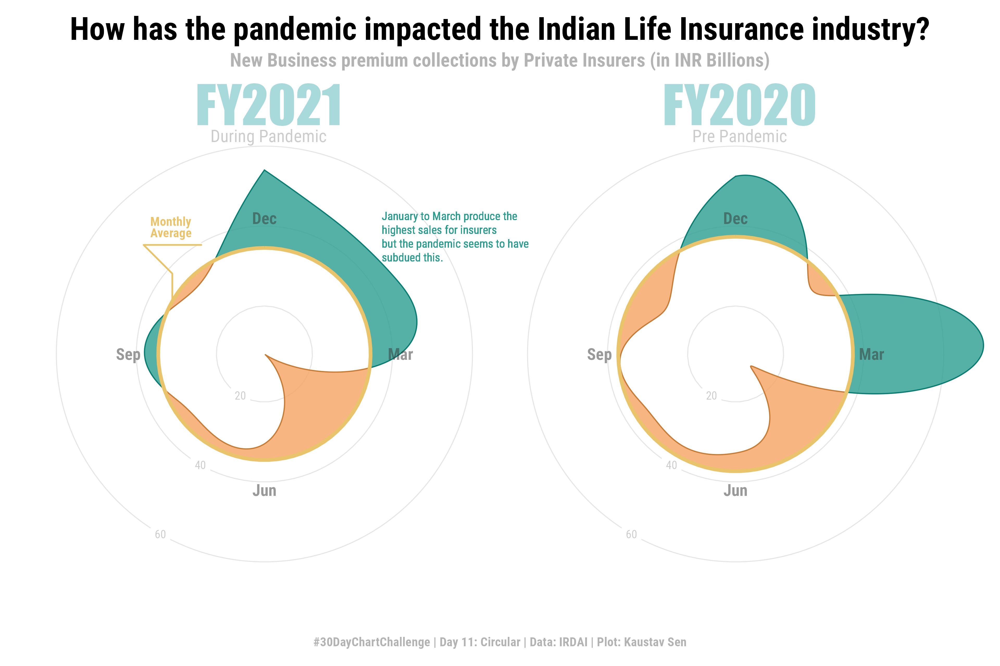

# 30DayChartChallenge

My contributions to the <a href='https://twitter.com/30DayChartChall'>#30DayChartChallenge</a> for April 2021.

## Day 2: Pictogram [<a href='day_02/day_02.R'>**Code**</a>]

## Day 3: Historical [<a href='day_03/day_03.R'>**Code**</a>]

## Day 4: Magical [<a href='day_04/day_04.R'>**Code**</a>]

## Day 5: Slope [<a href='day_05/day_05.R'>**Code**</a>]

## Day 6: Experimental [<a href='day_06/day_06.R'>**Code**</a>]

## Day 9: Statistics [<a href='day_09/day_09.R'>**Code**</a>]

## Day 10: Abstract [<a href='day_10/day_10.R'>**Code**</a>]

## Day 11: Circular [<a href='day_11/day_11.R'>**Code**</a>]

